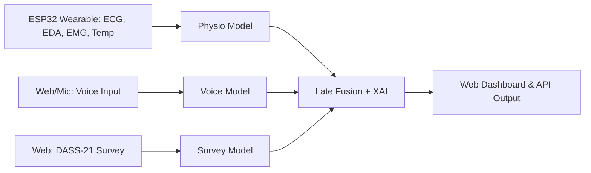

# SafeSpace AI

**Multimodal, Explainable, Real-Time Stress Detection Platform**

- [Overview](#overview)
- [System Architecture](#system-architecture)
- [Data Modalities](#data-modalities)
- [Sensing Hardware](#sensing-hardware)
- [AI Models & Fusion](#ai-models--fusion)
- [Explainable AI (XAI)](#explainable-ai-xai)
- [Results & Evaluation](#results--evaluation)
- [How to Run](#how-to-run)
- [Downloads & Outputs](#downloads--outputs)
- [Future Work](#future-work)
- [Contributors](#contributors)

## Overview

SafeSpace AI is an end-to-end, cloud-ready framework for **real-time, explainable, multimodal stress detection**.  
The system fuses physiological biosignals, voice cues, and self-reported questionnaire data via advanced AI, and delivers actionable, plain-language insights for both users and clinicians.

- **Live Demo:** [safespaceai.vercel.app](https://safespaceai.vercel.app)
- **Wearable hardware, transparent AI, instant results.**

## System Architecture



**Components:**  
- ESP32-based wearable hardware  
- FastAPI cloud backend (Python)  
- Next.js/React web dashboard  
- Modular ML stack for each modality

## Data Modalities

| Modality         | Features (examples)                       | Data Source         |
|------------------|-------------------------------------------|---------------------|
| Physiological    | ECG, EDA, EMG, Body Temp, HRV, freq. feats| ESP32 Wearable      |
| Voice            | MFCCs, pitch, energy, prosody, chroma     | Web/microphone      |
| Self-Assessment  | DASS-21 Stress Subscale (7 items, web)    | Web form            |

## Sensing Hardware

- **ESP32 microcontroller** with wireless data streaming
- **Sensors:** ECG, EDA, EMG, temperature
- **Rechargeable battery** (6+ hours use)
- **Wearable form factor**: ergonomic patch/armband
- Plug-and-play with SafeSpace AI backend

## AI Models & Fusion

- **Biosignals**: Random Forest, SVM, XGBoost, Extra Trees (WESAD data)
- **Voice**: CNN-BiGRU-Attention (IEMOCAP → RAVDESS)
- **Survey**: Stacking ensemble (RF, LR, NB + meta LR)
- **Late Fusion:**  
  - Weighted aggregation by model confidence and input quality  
  - Typical weights: 60% biosignals, 25% survey, 15% voice  
  - Robust to missing/partial data

## Explainable AI (XAI)

- **SHAP**: Feature attributions for biosignals & survey
- **LIME**: Explains voice/tabular predictions
- **Attention Visualization**: Neural model insight (voice)
- **LLM Integration**: Plain-language, actionable summaries for each prediction
- **Full XAI feedback** in user dashboard

## Results & Evaluation

| Modality         | Best Accuracy | Macro AUC | Datasets             |
|------------------|--------------|-----------|----------------------|
| Physiological    | 88.3%        | 0.97      | WESAD                |
| Voice            | 87.8%        | 0.97      | IEMOCAP, RAVDESS     |
| DASS-21 Survey   | 85.0%        | 0.96      | DASS-21              |
| **Fusion**       | **83.9%**    | **0.94**  | (All Combined)       |

- **Fusion improves detection of “medium” stress and overall reliability.**
- **All outputs** include SHAP/LIME/Attention plots and natural-language explanations.

## How to Run

### 1. Hardware & Data

- Flash ESP32, attach sensors as per `/hardware_setup.md`.
- Connect to web dashboard (`/frontend`), pair device & mic.

### 2. Backend

```bash
pip install -r requirements.txt
uvicorn backend.main:app --reload
```

### 3. Frontend

```bash
cd frontend
npm install
npm run dev
```

- Visit [localhost:3000](http://localhost:3000) or [safespaceai.vercel.app](https://safespaceai.vercel.app)

### 4. Model Training

- Run scripts in `/models` (e.g., `python train_physio.py`)
- Pretrained weights included for demo.

## Downloads & Outputs

- **Dashboard**: Real-time predictions, modality contributions, XAI explanations
- **Exports**:  
  - Class probabilities CSV  
  - Confusion matrix & ROC (PNG)  
  - SHAP/LIME plots  
  - Per-session summary reports

## Future Work

- Personalized/online learning per user
- Larger, more diverse datasets; multi-lingual support
- Federated and on-device privacy-preserving inference
- Full clinical & occupational trials

## Contributors

- Arsh Chatrath
- Devansh Wadhwani
- Durvish Khurana
- Kabir Oberoi
- Samya Agarwal
- Khushpreet Kaur
- Lakshita

SafeSpace AI bridges advanced hardware, modern ML, and explainable, real-time analytics for trustworthy mental health support.

*Live at [safespaceai.vercel.app](https://safespaceai.vercel.app). For documentation and details, see `/docs`.*
